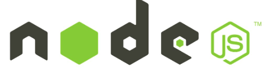

# BenAndJerry
Build [semantic templates](https://www.martin-brennan.com/semantic-templates-with-mustache-js-and-handlebars-js/) with [Handlebars](https://learn.co/lessons/node-js-intro-to-handlebars).  Semantic Javascript templates are used as a replacement to constructing long strings of HTML within your Javascript logic.  The way we send files from the back end to the front end is different than with Express.

    &    

# To install
Git Clone the repository

Navigate to the folder where the repository exists

Run the command $ npm init

Run the command $ npm install express --save

Run the command $ npm install express-handlebars --save

Run the command $ touch .gitignore, and store node_modules in it.

Then run the command $ server.js

Browser start with search for localhost:3000 

# Built With
* [HTML Escaping](https://handlebarsjs.com/) Handlebars HTML-escapes values returned by a {{expression}}. If you don't want Handlebars to escape a value, use the "triple-stash", {{{.

* [Layouts]() is simply a Handlebars template with a {{{body}}} placeholder. Usually it will be an HTML page wrapper into which views will be rendered.

* [Block Expressions](https://handlebarsjs.com/) allow you to define helpers that will invoke a section of your template with a different context than the current. These block helpers are identified by a # preceeding the helper name and require a matching closing mustache, /, of the same name.
